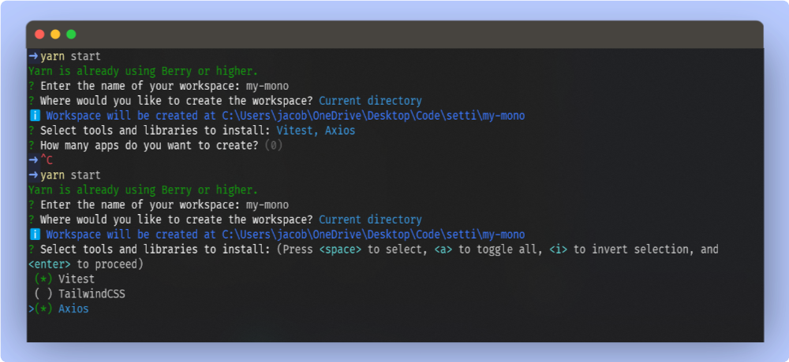
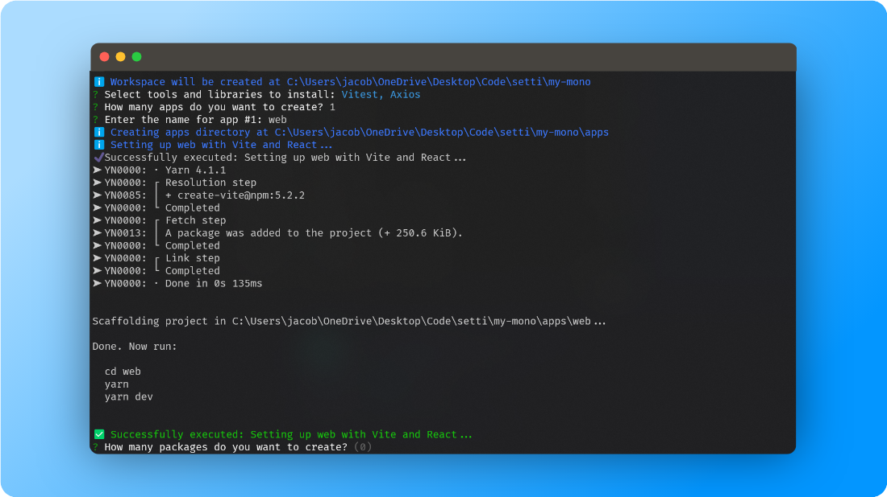
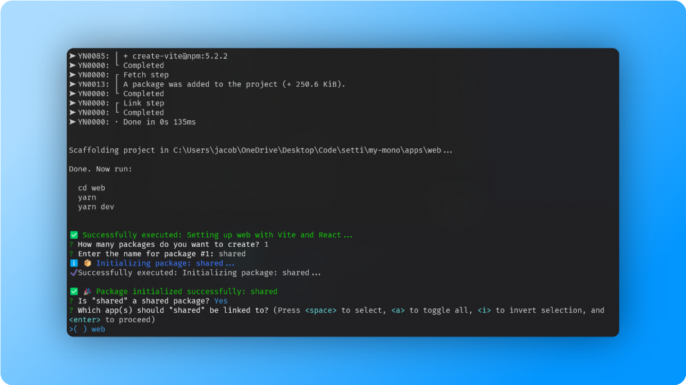

# 🌀 Workspace Spinner

    

> 🚀 Effortlessly spin up new JavaScript project workspaces with just a few commands! Workspace Spinner is your CLI companion to weave together Yarn workspaces, ESLint, Prettier, Husky, and more, into a ready-to-code project structure. 🛠️✨

## 📖 Description

Workspace Spinner is designed to simplify the initial setup process for developers, whether you're creating a web app, building a library, or starting a new side project. With a focus on modern JavaScript environments, this tool automates the mundane tasks, letting you dive straight into the creative part of development.

## 🎥 Demo





Watch Workspace Spinner in action as it sets up a new project workspace. The demo illustrates how quickly and seamlessly you can get from zero to a fully configured development environment.

## 🚀 Features

- **Yarn Workspace Setup**: Organize your project with Yarn workspaces for better dependency management.

- **Coding Standards**: Integrate ESLint and Prettier to maintain a consistent coding style.

- **Git Hooks**: Utilize Husky to enforce code quality checks before commits and pushes.

- **Quick Start**: Jumpstart your project with pre-configured settings, minimizing the initial boilerplate.

## 📦 Installation

```bash

yarn global  add  workspace-spinner
```

Or if you prefer, you can clone the repository and run it locally:

```bash

git clone  https://github.com/jacobwi/workspace-spinner.git


cd  workspace-spinner

yarn install
```

## 🚀 Usage

Navigate to your project directory and run:

```bash

workspace-spinner init
```

Follow the interactive prompts to configure your workspace!

## 🛠️ Development

Want to contribute? Great! Workspace Spinner is a work in progress, and we welcome contributions from the community. Here's how you can help:

Fork the repo

Create a new feature branch (git checkout -b feature/AmazingFeature)

Commit your changes (git commit -am 'Add some AmazingFeature')

Push to the branch (git push origin feature/AmazingFeature)

Open a new Pull Request

## 📝 License

This project is MIT licensed.

⚠️ _Note: This project is a work in progress. Features are subject to change, and contributions are warmly welcomed!_
